  

## Hi there 👋

- 🔭 I currently work at **Stefanini Group**, assigned to **BB Technology**, developing full-stack enterprise applications.
- 💻 Main stack: **Angular · TypeScript · Java · Quarkus · React · Next.js · PostgreSQL · REST APIs · Azure**
- 🌱 I work with microservices architecture, RESTful API integration, and PostgreSQL data modeling.
- 🤝 Open to CLT opportunities in Brazil and remote international roles.
- 📫 Contact: acvb.dev@gmail.com
- 🔗 LinkedIn: [linkedin.com/in/acvbdeveloper](https://www.linkedin.com/in/acvbdeveloper)
- 📍 Brasília, DF, Brasil

### 💻 Most frequent programming languages

  

  

